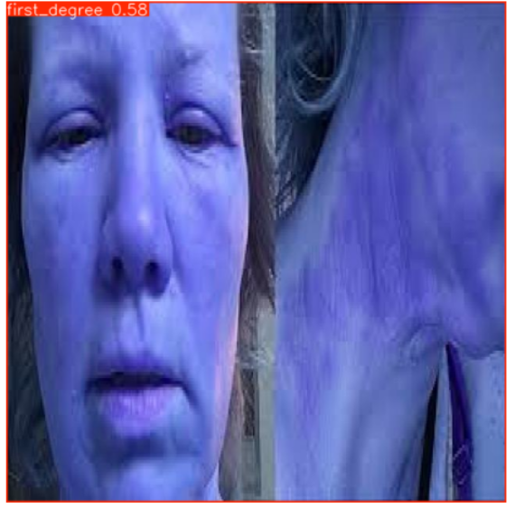
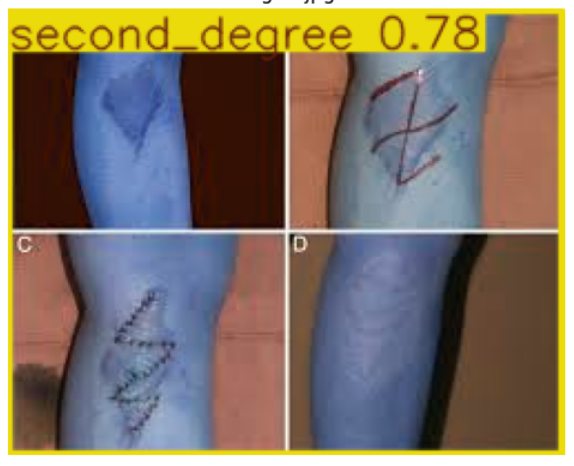
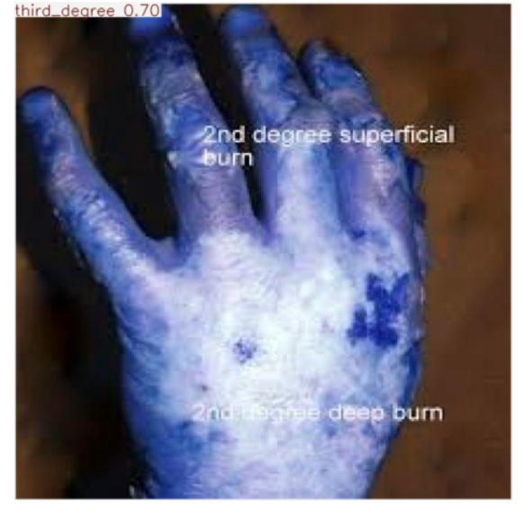

# 🧠 Skin Burn Detection using YOLO (v8 + Custom Backbone)

## 📌 Overview
This project focuses on **automated skin burn detection and classification** using deep learning-based object detection models. The system classifies burn severity into:

- First Degree Burn  
- Second Degree Burn  
- Third Degree Burn  

We experimented with:
- Baseline YOLOv8 model
- Custom modified YOLO architecture (YOLOv8 + YOLOv11-inspired backbone)
- Dataset refinement using manual annotation

---

## 🎯 Problem Statement
Burn injuries require fast and accurate diagnosis. Manual classification is subjective and time-consuming. This project aims to automate burn detection using deep learning to assist medical decision-making.

---

## 📊 Dataset

- Images collected from multiple open-source internet datasets
- Custom annotation performed using labeling tools
- Classes:
  - First Degree Burn
  - Second Degree Burn
  - Third Degree Burn

### Dataset Improvements
- Removed noisy and incorrect images
- Manually relabeled bounding boxes
- Improved class balance
- Fixed annotation inconsistencies

---

## ⚙️ Methodology

### 🔹 Phase 1: Baseline Model (YOLOv8n)
- Trained standard YOLOv8n model
- Observed low performance and unstable detection
- mAP was not satisfactory

---

### 🔹 Phase 2: Architecture Modification
- Modified YOLOv8 architecture by integrating YOLOv11-inspired backbone
- Retained YOLOv8 detection head
- Goal: improve feature extraction capability

---

### 🔹 Phase 3: Dataset Refinement (Key Improvement)
- Manually corrected annotations
- Improved labeling accuracy using annotation tools
- This step significantly improved performance compared to architecture changes

---

## 📈 Results

| Model | mAP@50 | mAP@50-95 | Precision | Recall |
|------|--------|-----------|-----------|--------|
| YOLOv8 Baseline | 0.44 | 0.20| 0.517 | 0.485 |
| Custom YOLO (v8 + v11 backbone) | 0.774 | 0.768 | 0.64 | 0.807 |

---

## 📊 Visual Results

### 🔹 Confusion Matrix


### 🔹 Training Loss


### 🔹 Detection Results





## 🚀 Inference (Testing on Images)

Run detection on a single image:

```bash
python inference.py --image test.jpg
